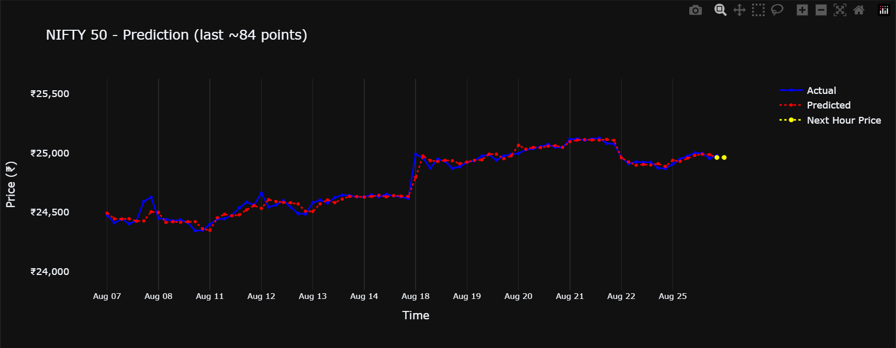

# Real-Time Indian Stock Market Analysis and Prediction

### Abstract

This is an ongoing project, started in August 2025, that aims to automatically analyze and predict real-time movements in the Indian stock market. The main goal is to give data-driven insights into where certain Indian stocks and indexes might be headed. The system constantly gathers data, creates smart features for analysis, builds predictive models, and shows the results with interactive charts. It also learns over time as new data becomes available, so the predictions get better.

### Problem Statement and Solution

**The Challenge:** The stock market is fast-paced and complex. Trying to analyze everything manually is time-consuming and can make you miss important trends.

**My Solution:** This project solves that problem by creating a system that automates the entire process. It continuously learns and provides up-to-date market insights, helping users make faster, more data-driven decisions.

### Introduction

This project is an automated tool for analyzing and predicting the stock market. It uses a complete machine learning pipeline, from getting the data to showing you the predictions. The system is built to be robust, meaning it can update its data and predictions on its own, so the insights you get are always fresh and relevant.

### How It Works

The system follows a simple process:

1.  **Data Collection**: It gets real-time stock and index data from financial APIs, such as the open-source tool Yahoo-Finance.
2.  **Data Handling**: It keeps all the historical and predicted data up-to-date.
3.  **Feature Engineering**: It creates smart, lag-based features from the historical data to make the predictions more accurate.
4.  **Predictive Modeling**: Using powerful machine learning models like Random Forest and XGBoost, the system learns and improves its predictions as new data comes in.
5.  **Visualization**: It generates interactive plots that let you see market trends in two ways: a broad overview and a detailed look at recent activity.
6.  **Future Plans**: We are currently developing a Django or Streamlit app to show these real-time predictions and interactive plots in a user-friendly way.

---

### Tools and Technologies Used

* **Programming Language**: Python
* **Data Handling**: Pandas
* **Data Retrieval**: Financial APIs (e.g., Yahoo-Finance)
* **Machine Learning**: Ensemble ML Models (Random Forest, XGBoost, and we plan to add more like LSTM, RNN)
* **Visualization**: Plotly
* **Web Development (Future)**: Django, Streamlit

---

## 🤝 Let’s Connect!

😊 I’m always open to meaningful conversations, collaborative projects, and idea exchanges in.
If you’re interested in discussing new insights, working together on related topics, or contributing to ongoing discussions — feel free to reach out!
**Let’s learn and build together 🚀**
